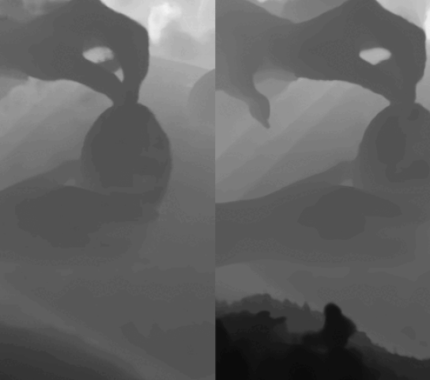
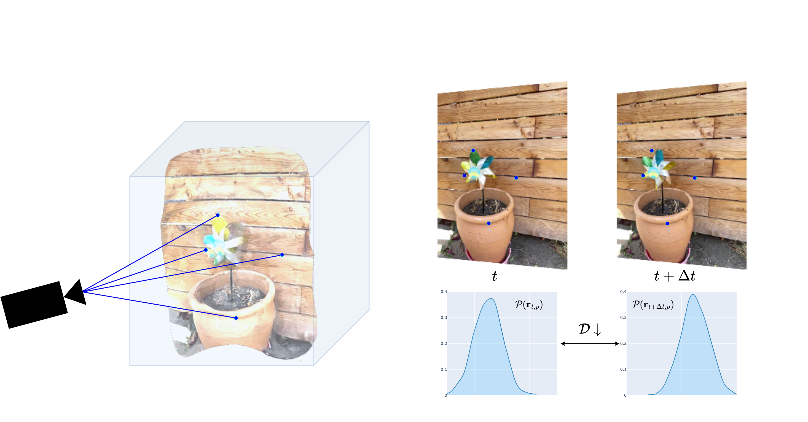

# Improving the Convergence of Dynamic NeRFs via Optimal Transport
### Sameera Ramasinghe*, Violetta Shevchenko*, Gil Avraham, Hisham Husain, Anton van den Hengel
## The Twelfth International Conference on Learning Representations (ICLR, 2024)


---------------------------------------------------
This is the official code for the paper [Improving the Convergence of Dynamic NeRFs via Optimal Transport](https://openreview.net/pdf?id=KiespDPaRH)

  

A comparison between with our regularization (left) and without our regularization (right). We constrain the optimal transport distance between rendered pixel distributions for better onvergence of dynamic NeRFs. 


Synthesizing novel views for dynamic scenes from a collection of RGB inputs poses significant challenges due to the inherent under-constrained nature of the problem. To mitigate this ill-posedness, practitioners in the field of neural radiance fields (NeRF) often resort to the adoption of intricate geometric regularization techniques, including scene flow, depth estimation, or learned perceptual similarity. While these geometric cues have demonstrated their effectiveness, their incorporation leads to evaluation of computationally expensive off-the-shelf models, introducing substantial computational overhead into the pipeline. Moreover, seamlessly integrating such modules into diverse dynamic NeRF models can be a non-trivial task, hindering their utilization in an architecture-agnostic manner. In this paper, we propose a theoretically grounded, lightweight regularizer by treating the dynamics of a time-varying scene as a low-frequency change of a probability distribution of the light intensity. We constrain the dynamics of this distribution using optimal transport (OT) and provide error bounds under reasonable assumptions. Our regularization is learning-free, architecture agnostic, and can be implemented with just a few lines of code. Finally, we demonstrate the practical efficacy of our regularizer across state-of-the-art architectures.
## Notes
* *This is the preliminary version of the code, which may contain bugs. Please open an issue if you encounter any.


## Requirements
* lpips
* mmcv
* imageio
* imageio-ffmpeg
* opencv-python
* pytorch_msssim
* torch
* torch_scatter
* pandas
* torchrbf
* Ninja
* Pillow
* geomloss

## Data Preparation
The dataset provided by [DyCheck](https://drive.google.com/drive/folders/1ZYQQh0qkvpoGXFIcK_j4suon1Wt6MXdZ) or the interpolation dataset by [HyperNeRF](https://github.com/google/hypernerf) can be used.
Organize your dataset as below (Double check if your dataset directory path is compatible with the corresponding config file in the   ``configs`` folder). 
```
├── iphone-apple 
│   ├── scene.json
│   ├── rgb 
│   ├── ...
```

## Training

``` 
python run.py --config {config path} --wreg 1 --interp 1 --gpunum {gpu number} --expname {experiment name}
``` 

Some useful config arguments that can be specified.

```
--wreg {to use the ot regularization or not} 
--interp {to interpolate the random rendered pixels or not}  
--kernel {kernel function to be used for interpolation}
--smoothing {smoothing factor of interpolation} 
--ot {Optimal transport method to be used}
```

## Evaluation
Run the following script to evaluate the model.  

```
python run.py {config path} --render_test --render_only --eval_psnr --gpunum {gpu number} --expname {saved experiment name}' 
```

## Acknowledgements
This repository is  based on [TiNeuVox](https://github.com/hustvl/TiNeuVox). We appreciate the authors for generously sharing their code.


## Citation
If you find this repository/work helpful in your research, please cite our paper.
```
@inproceedings{
    ramasinghe2024improving,
    title={Improving the Convergence of Dynamic Ne{RF}s via Optimal Transport},
    author={Sameera Ramasinghe and Violetta Shevchenko and Gil Avraham and Hisham Husain and Anton van den Hengel},
    booktitle={The Twelfth International Conference on Learning Representations},
    year={2024},
    url={https://openreview.net/forum?id=KiespDPaRH}
}
```
